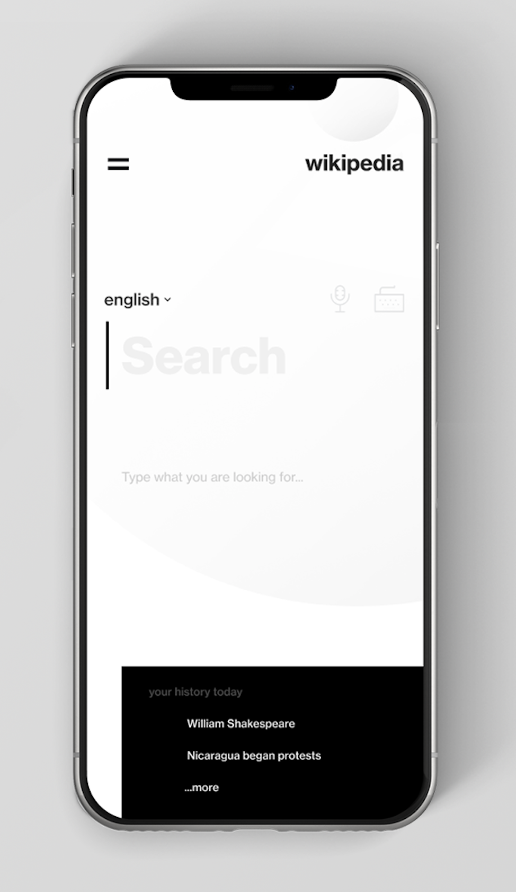

# Flikipedia

A Minimalistic flutter application which uses Wiki Search API.

## Mockup and Implementation
&nbsp;&nbsp;&nbsp;&nbsp;

## Features
 - Caching API responses
 - Adaptive icons on Android
 - Long press to share a result to other apps.
 - Clear caches in a single click
 - Toast messages to denote the user if he is seeing the cached data or from API
 - Native Splash screen
 - Dynamic Theme support (Presistant)